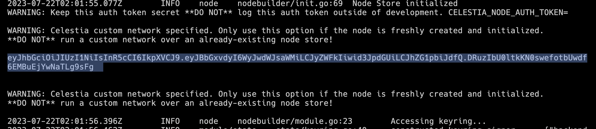
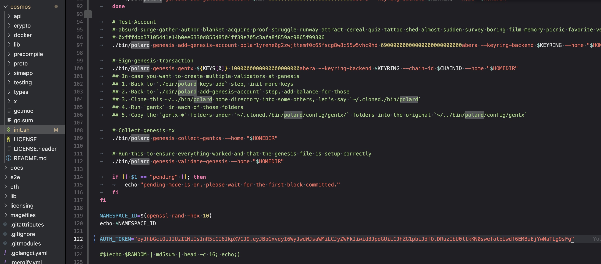

# Dev n Tell Workshop - Developer DAO

## Berachain Polaris x Celestia Light Node

First, clone this repository. Then from the root of this repo, build the docker image:

<!-- TODO update this to use light node -->

### 1. Start a Celestia Light Node

#### 1.1 - Initialize the node

```bash
celestia light init --p2p.network arabica
```

#### 1.2 - Start the node

```bash
celestia light start --core.ip consensus-full-arabica-9.celestia-arabica.com --p2p.network arabica
```

NOTE: your node will need to be fully synced to retrieve data!

Query your SamplingStats status with:

```bash
export CELESTIA_NODE_AUTH_TOKEN=$(celestia light auth admin --p2p.network arabica)
celestia rpc das SamplingStats
```

#### 1.3 - Fund your node

At [https://faucet-arabica-9.celestia-arabica.com](https://faucet-arabica-9.celestia-arabica.com)

#### 1.4 - Copy the auth token

```bash
celestia light auth admin --p2p.network arabica | pbcopy
```

### 2. Put Auth Token into polaris/cosmos/init.sh

This auth key is required to authorize rollkit to post to the DA.



Place it in `polaris/cosmos/init.sh`



### 3. Install Foundry && Start the Polaris Chain

```bash
curl -L https://foundry.paradigm.xyz | bash
```

Then in a new window

```bash
foundryup
cd polaris && mage start
```

### 4. The following private key has funds on the Polaris Chain

```bash
Address: 0x20f33CE90A13a4b5E7697E3544c3083B8F8A51D4
PrivateKey: 0xfffdbb37105441e14b0ee6330d855d8504ff39e705c3afa8f859ac9865f99306
```

### 5. Clone the GM Portal repository

```bash
cd $HOME
git clone https://github.com/jcstein/gm-portal.git
cd gm-portal/frontend
yarn && yarn dev
```

Export private keys:

```bash
export PRIVATE_KEY=0xfffdbb37105441e14b0ee6330d855d8504ff39e705c3afa8f859ac9865f99306
export RPC_URL=http://localhost:8545
```

### 6. Deploy the GM Portal

```bash
cd $HOME/gm-portal/contracts
forge script script/GmPortal.s.sol:GmPortalScript --rpc-url $RPC_URL --private-key $PRIVATE_KEY --broadcast
```

Set the contract address as a variable:

```bash
export CONTRACT_ADDRESS=<your contract address from the output above>
```

### 7. Interact with the contract

Send a "gm" to the contract:

```bash
cast send $CONTRACT_ADDRESS \
"gm(string)" "gm" \
--private-key $PRIVATE_KEY \
--rpc-url $RPC_URL
```

Get total GMs:

```bash
cast call $CONTRACT_ADDRESS "getTotalGms()" --rpc-url $RPC_URL
```

### 8. Update the frontend

[https://docs.celestia.org/developers/gm-portal-bubs/#update-the-frontend](https://docs.celestia.org/developers/gm-portal-bubs/#update-the-frontend)
